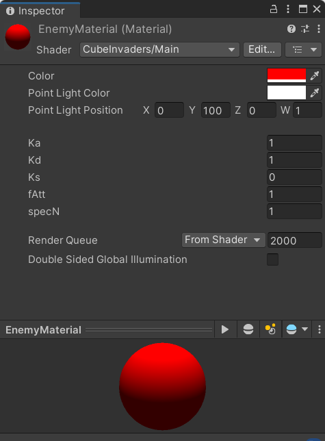
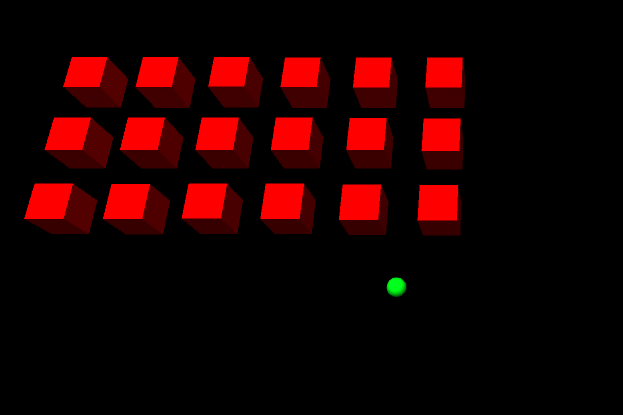
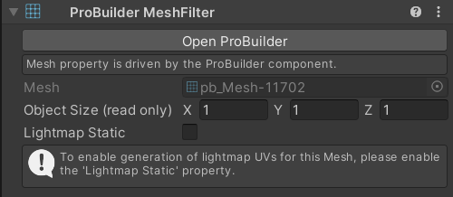
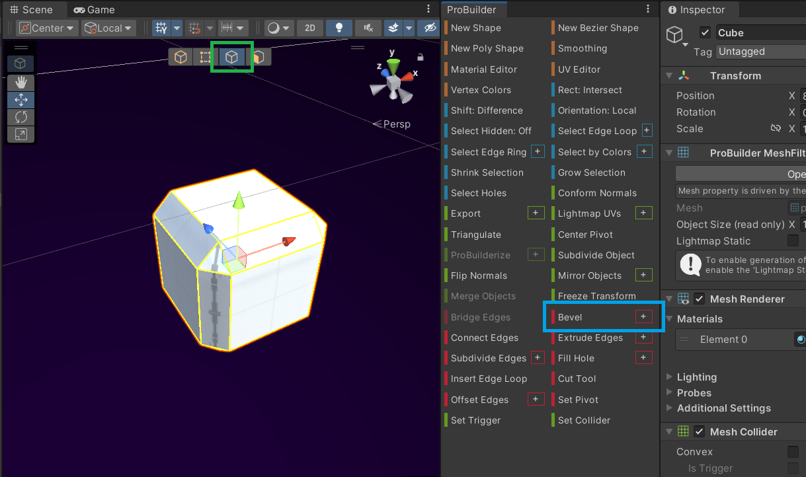
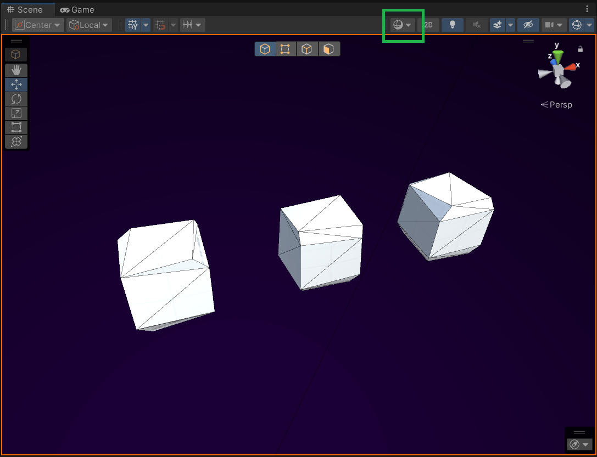

**The University of Melbourne**
# COMP30019 – Graphics and Interaction

## Workshop 11: Advanced Gameplay Elements

<p align="center">
  
</p>

<p align="center">
  <a href="https://comp30019.github.io/Workshop-11-Solution/" alt="Play Online">
    
  </a>
</p>


### Overview

In this workshop _Cube Invaders_ will return for the very last time, the goal
being to integrate some of the shader material you've seen in previous
workshops into a game environment, and to cover a few "advanced" techniques
which could be useful as you refine your projects. Today our focus is on adding
"polish" rather than making major gameplay changes, and some of the
modifications will appear quite subtle in isolation, but together will add up
to make a noticeable difference to the overall aesthetic.

> **Note**<br>
> This repository is based on the solution from workshop 6. You are welcome to
> work off this repository as a base, or your own solution up until this point.
> The tasks in this workshop assume you understand how everything up until this
> point works, and have a reasonable understanding of shader programming. 

### Tasks

#### 1. Shared shaders

In this first task you will create a custom shader to take the place of the
"Standard Shader" which is currently used by all the materials in the project.
We are ultimately aiming for a simple flat-shaded "cartoon" aesthetic where
every surface will be diffuse (no specular highlights) and so will use a
simple Phong shader as a base to work from.

To start, import the Phong shader created in the [illumination and shading
workshop](https://github.com/COMP30019/Workshop-9) into the project assets (it
might be a good idea to create a new folder called `Shaders` to keep things
organised). We are not going to be using vertex colours or textures here, so
you should modify it to _uniformly_ colour an object via a new `_Color`
property. Make sure it is possible to change the colour of the object via the
inspector in the editor by adding a corresponding entry to the `Properties`
block of the ShaderLab code.



Also change the name of the shader to something more "general" by both renaming
the shader source file to `Main.shader` and also updating the ShaderLab code
itself. Use a "namespace" called `CubeInvaders` to avoid (potential) naming
conflicts resulting from the generic name, like so:

```hlsl
Shader "CubeInvaders/Main" 
{
    ...
}
```

Switch the shader utilised by the enemy material asset (inside
`/Assets/Materials`) from "Standard Shader" to "CubeInvaders/Main" and observe
the properties of the shader change in the inspector. Remember that these are
passed to the shader at runtime to fine-tune the shader computations (mapped to
`uniform` parameters in the HLSL code). These properties (and their defaults)
are defined in the `Properties` block of the ShaderLab code.

You should appropriately fine-tune the inspector properties for the enemy
material to achieve a completely diffuse look with the light source coming from
a point high above the scene. Repeat the same process for all other materials
in the project (i.e. everything inside `/Assets/Materials`). The final result
will not be radically different from the original, but the next task will
change that!

#### 2. Enhanced explosions

Now that we have a shared shader asset applied to all materials, we can add
global shader effects that will be applied to all objects in the scene. In this
task you will add a "shockwave" effect that enhances the explosions in the
game.

This effect should be achieved by modifying the vertex shader to selectively
displace vertices in world space, similar to what you did in the [vertex
shaders workshop](https://github.com/COMP30019/Workshop-8). Here though, there
are some additional considerations you'll take into account:
- The vertex displacement caused by any given shockwave should only be visible
when an explosion actually occurs, that is, there should be a "start time" and
"end time" for each shockwave.
- There could be multiple explosions occurring at once and displacements should
be added cumulatively if so (due to fixed-size array limitations in HLSL, you
may assume that **at most 10** will be active at any given time). 
- It should be possible for each individual shockwave to be parameterised such
that it can be fine-tuned separate to the others. At the very least you should
parameterise the "amplitude" and "speed" of each shockwave.
- The effect should be triggered via a new C# component called `Shockwave.cs`
which can be used on any object in the game (you may also need another script
to "centralise" the global shader updates as described below).
- The effect should be three-dimensional, meaning that a shockwave should
displace vertices in the direction defined by the origin of the shockwave "to"
the vertex position. A given vertex should not be displaced until the shockwave
reaches them based on the shockwave's speed and distance from the origin.

> **Note**<br>
> There is a lot to think about here, so try to incrementally solve the problem
> starting with aspects you find easiest. For example, start by getting a
> simple displacement effect working (perhaps using some hardcoded values in
> the shader), then add the time component, then handle paramterisation, etc.
> Regular testing is critical when working with shaders since debugging them is
> notoriously difficult.

As a starting point, you may use the HLSL code snippet below that defines a set
of shockwave parameters and a function to compute the displacement of a vertex
given these parameters. While you could copy this code into the existing
`Main.shader` file, it is cleaner to create a separate shader `.cginc` file and
[include it](https://docs.unity3d.com/Manual/SL-BuiltinIncludes.html) in the
main shader asset. This enhances future reusability while also keeping the code
modular and easy to maintain.

```hlsl
#define MAX_SHOCKWAVES 10 // Must correspond to the max in Shockwave.cs
#define PI             3.141592f

uniform float  _GameTime;
uniform float3 _ShockwavePositions[MAX_SHOCKWAVES];
uniform float  _ShockwaveAmplitudes[MAX_SHOCKWAVES];
uniform float  _ShockwaveSpeeds[MAX_SHOCKWAVES];
uniform float  _ShockwaveStartTimes[MAX_SHOCKWAVES];
uniform float  _ShockwaveEndTimes[MAX_SHOCKWAVES];

float4 ComputeShockwaveDisplacement(float4 vertexPosition)
{
    float3 totalDisplacement = 0;

    for (int i = 0; i < MAX_SHOCKWAVES; i++)
    {
        // TODO: Compute the displacement for the current shockwave.

        // Add this displacement to the total displacement.
        totalDisplacement += displacement;
    }

    return vertexPosition + float4(totalDisplacement, 0);
}
``` 

> **Note**<br>
> The `ComputeShockwaveDisplacement` function should take in a _world space_
> vertex position and replace it with some (potential) displacement added.
> Think carefully about the appropiate place to call it from in the
> pre-existing `Main.shader` vertex shader. 

Likewise, the following C# code snippet may be used to globally update the
shockwave parameters from any component in the game:

```csharp
Shader.SetGlobalVectorArray("_ShockwavePositions", _shockwavePositions);
Shader.SetGlobalFloatArray("_ShockwaveAmplitudes", _shockwaveAmplitudes);
Shader.SetGlobalFloatArray("_ShockwaveSpeeds", _shockwaveSpeeds);
Shader.SetGlobalFloatArray("_ShockwaveStartTimes", _shockwaveStartTimes);
Shader.SetGlobalFloatArray("_ShockwaveEndTimes", _shockwaveEndTimes);
```

Here, all of the `_shockwave*` variables should be C# arrays that contain the
parameters for each shockwave (each shockwave is identified by an index). Note
that we are using the "Global" variants of the `Shader.Set*` functions, meaning
that the updates are applied across all materials in the scene (that is, there
is no need for a specific material reference). This is handy since finding all
of the materials and updating them individually would be tedious and
inefficient.

Ensure that the C# arrays are appropriately sized to match the shader arrays,
and think carefully about how time is utilised in the shader to synchronise the
effect with CPU "game time". Make sure you test transitions between scenes to
ensure that the time is synchronised correctly upon replaying the game. If
necessary, use the `uniform float _GameTime` variable and update it each frame
from a C# script for some extra control here. 

> **Warning**<br>
> You cannot assume that uniform attributes will be default-initialized before
> they are _explcitly_ set (think back to the horrors/delights of your C
> programming days, HLSL is similar). Ensure all such shader variables are
> globally initialized to appropriate defaults _before_ the shader is used.

Once you have gotten the shockwave effect working to your liking, trigger it
whenever a cube is destroyed to enhance the already existing explosions. Keep
the magnitude of the effect relatively modest as it could be quite distracting
if it's too strong.

<p align="center">
  
</p>


#### 3. Cartoonified cubes

Next, we will add more polish to the game by making the cubes a little less
boring and repetitive. Instead of using Unity's built-in cube mesh, we'll
procedurally generate a custom mesh using an officially maintained Unity
package called [ProBuilder](https://unity.com/features/probuilder).

This package first has to be installed via the Unity Package Manager. To do
this, go to **Window -> Package Manager** and search for "ProBuilder". Click
the **Install** button to install the package. Once it's installed, you should
see a new **ProBuilder** menu group in the Unity **Tools** menu, as well as an
additional context menu when right-clicking in the scene view.

> **Note**<br>
> You can find the official documentation for ProBuilder
> [here](https://docs.unity3d.com/Packages/com.unity.probuilder@5.1/manual/index.html),
> and like always, it's a good idea to skim through it a little to get some
> additional context around what it can do before continuing. At the time of
> writing, the latest version of ProBuilder is 5.1, but theoretically any 5.x
> version should work fine since the API is unlikely to change much between
> minor versions.



Create a new **ProBuilder Cube** object in the scene. Observe that there is a
**ProBuilder Mesh Filter** component attached to the object that represents
ProBuilder-specific meshes (internally these become ordinary Unity meshes).
Within this component click the **Open ProBuilder** button to open the
ProBuilder editor window. This window allows you to edit the mesh like you
would edit a mesh in a 3D modelling program like Blender, but all within the
Unity editor!

Before continuing, experiment with using the "Bevel" tool on the cube's edges.
You will need to select the edges first, using the edge select mode (green
rectangle in the below screenshot). Then the bevel tool can be found in the
ProBuilder toolbar (blue rectangle). Try applying the bevel tool to different
subsets of selected edges to get a feel for what it does. You can also click
the little "plus" button to bring up a settings dialog that lets you change the
magnitude of the bevel. In the image below the bevel effect has been applied to
every edge of the cube.

<p align="center">
  
</p>

The bevel tool is going to be the basis for our "cartoonified" cubes, but we'll
call the ProBuilder API from a C# script instead of using the Unity editor,
since we want each cube to be procedurally randomised.

Create a fresh "default" ProBuilder cube without any modifications applied. Add
a new C# script called **CartoonifyPbMesh.cs** and attach it to the cube. This
script should apply a random bevel to it, then randomly manipulate the faces of
the cube (e.g., rotate and scale them) to add asymmetric variation.

> **Note**<br>
> You'll probably want to read the [ProBuilder API
documentation](https://docs.unity3d.com/Packages/com.unity.probuilder@5.1/manual/api.html)
to figure out how to manipulate ProBuilder meshes. While some guidance is given
below, we want you to try to develop your own solution to this problem. You are
welcome to be creative and not restrict yourself to just the bevel API. 

Here are some hints to help you along the way:
- The component that allows you to edit the mesh in the editor window is called
  `ProBuilderMesh`, and like any other component, you can access it via Unity's
  `GetComponent` method or by adding a serialized `ProBuilderMesh` field to
  your script.
- The `ProBuilderMesh` class is in the `UnityEngine.ProBuilder` namespace, and
  like any other C# namespace, may be included in the script via the `using`
  keyword. Note that you may need to reopen your code editor from Unity for it
  to recognise the new namespace.
- The **Bevel** tool API is accessible via the
  [`Bevel.BevelEdges`](https://docs.unity3d.com/Packages/com.unity.probuilder@5.1/api/UnityEngine.ProBuilder.MeshOperations.Bevel.html)
  method in the `UnityEngine.ProBuilder.MeshOperations` namespace. 
- The `ProBuilderMesh` class has a `faces` property that gives a list of
  [`Face`](https://docs.unity3d.com/Packages/com.unity.probuilder@5.1/api/UnityEngine.ProBuilder.Face.html)
  objects representing the faces of the mesh. Similarly, each face object has
  an `edges` property that gives a list of
  [`Edge`](https://docs.unity3d.com/Packages/com.unity.probuilder@5.1/api/UnityEngine.ProBuilder.Edge.html)
  objects representing the edges of the face.
- The
  [`MeshOperations.WeldVertices`](https://docs.unity3d.com/Packages/com.unity.probuilder@5.1/api/UnityEngine.ProBuilder.MeshOperations.VertexEditing.html#UnityEngine_ProBuilder_MeshOperations_VertexEditing_WeldVertices_UnityEngine_ProBuilder_ProBuilderMesh_System_Collections_Generic_IEnumerable_System_Int32__System_Single_)
  merges vertices that are within some threshold distance of each other. This
  may be useful after adding some random variation to clean up overlapping
  geometry.
- There is a utility method called
  [`Math.NormalTangentBitangent`](https://docs.unity3d.com/Packages/com.unity.probuilder@5.1/api/UnityEngine.ProBuilder.Math.html#UnityEngine_ProBuilder_Math_NormalTangentBitangent_UnityEngine_ProBuilder_ProBuilderMesh_UnityEngine_ProBuilder_Face_).
  that takes a ProBuilder mesh and a face and returns an object containing the
  "normal", "tangent" and "bitangent" vectors for the face. Together these
  vectors define a local coordinate system for the face, which is useful for
  manipulating the face relative to the direction it is facing.
- Once you have manipulated the mesh, you should call the `Refresh` and the
  `ToMesh` methods on the `ProBuilderMesh` to automatically recompute normals
  and regenerate the underlying Unity mesh.

Like in the previous task, you should approach this problem incrementally.
Start by getting a simple bevel effect working via the script, then add the
random face manipulation by starting with simple rotations, then add scaling,
etc. Below are a few close up examples of the effect we achieved in our
solution.

<p align="center">
  
</p>

> **Note**<br>
> Note that we have turned on "Shader Wireframe" mode in the above scene to
make it easier to see the geometry of the mesh. This setting can be found via
the highlighted menu (green rectangle) in the above image.

Once you have fine-tuned the effect to your liking, don't forget to apply it to
both the player and enemy cubes in the game. This will require modifying the
existing enemy prefab located inside `/Assets/Prefabs/`.

#### 4. Additional ambiance

Now we will further polish the game by creating an "outer-space atmosphere"
background that persists between the menu and game scenes. First, add a large
plane that sits at a fixed distance from the camera. Apply a new material that
is coloured dark purple-blue utilising the same `Main.shader`. The plane should
be large enough to cover the entire viewport and should be positioned so that
it is at a fixed distance with respect to the camera.

Next, add a particle system that slowly emits small white particles from the
center of the plane towards the camera. We want to create the impression of a
starfield that is stylised to match the cartoon-ish look and feel of the game.
You may need to repostion the plane further from the camera to fine-tune the
"shape" of the particle system such that there is a feeling of depth. The below
GIF shows a side-on view of the overall effect in our solution.

<p align="center">
  
</p>

As seen in the above image, you should create a prefab for the entire effect
(here we've called it "ViewportManager") that can be reused in both the menu
and game scenes. The camera should be part of the same prefab, and both the
particle system and background should be a child of the camera. This will
ensure that the particle system is always positioned at a fixed distance from
the camera, and always facing the camera.

> **Note**<br>
> Currently the camera doesn't move, but if it did, using a parent-child
relationship in this manner would create the illusion of a background that is
"infinitely" far away. Another slightly more complex technique that achieves a
similar effect is a
[skybox](https://docs.unity3d.com/Manual/skyboxes-using.html). Skyboxes are
especially useful when the camera is able to look in any direction (e.g., in a
first-person shooter game).

Remember to add the prefab to both the menu and game scenes, and make sure that
the particle system persists between scene changes without restarting. You
should also _prewarm_ the particle system when the game starts so that the
whole starfield is visible right away. You can set the **Prewarm** option in
the particle system's [main module
settings](https://docs.unity3d.com/Manual/PartSysMainModule.html).

#### 5. Post-processing (extension)

This extension task gets you to research and add one or more [post-processing
effects](https://docs.unity3d.com/Manual/PostProcessingOverview.html) to the
game. Post-processing effects are applied after the camera renders the entire
scene and hence usually affect the entire two-dimensional "screen space".
Anti-aliasing is one such effect, used to reduce jagged edges in the rendered
image. [Bloom effects](https://en.wikipedia.org/wiki/Bloom_(shader_effect)) are
quite popular in many games and can be used to make bright objects appear to
"glow" a little. [Depth of field](https://en.wikipedia.org/wiki/Depth_of_field)
effects can make objects in the foreground appear sharp and objects in the
background appear blurry. These are just a few examples of what is possible!

> **Warning**<br>
> Post-processing effects can be quite computationally expensive, so you should
> be careful not to add too many of them to your game without considering the
> performance implications. To combat this, games often include quality
> settings that allow for some degree of customisation on the user's end.

To add post-processing effects to the game, you will need to install the [Post
Processing
Stack](https://docs.unity3d.com/Packages/com.unity.postprocessing@3.3/manual/index.html)
package via the Unity Package Manager. Once installed, follow the [getting
started](https://docs.unity3d.com/Packages/com.unity.postprocessing@3.3/manual/Quick-start.html)
instructions in the docs to see how to add a post-process layer to the camera
as well as a post-process volume that globally applies a post-processing
profile that you create. It's a good idea to apply these changes to the
"ViewportManager" prefab from the previous task so that they are automatically
applied across both the menu and game scenes.

Adding post-processing effects can make a dramatic difference to the look and
feel of the game, so it's worth experimenting with different effects and
settings to see what it possible. In our solution we've added a relatively
subtle bloom effect to make the cubes "glow" a little as well as enabled some
simple anti-aliasing. 

Have fun, and don't forget to test out a WebGL build of the game to see how it
looks in a browser!
